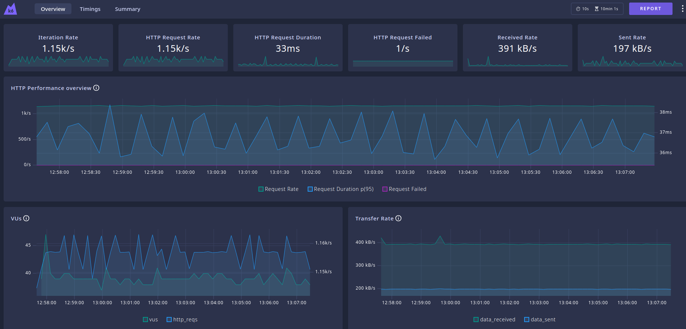

# k6 load testing

Install k6 cli https://grafana.com/docs/k6/latest/set-up/install-k6/ 

Takes an CSV 3scale.csv in the following format


| **Request Per Day** | **Request Per Minute** |
| --- | --- |
| 100 million | 69420 | 
| 50 million | 33000 |
| 20 million | 13920 |
| 5 million | 3472 |
| 1 million | 694 |

So to run 100 million request 

```bash
export rpm=69420
rpm=$RPM K6_WEB_DASHBOARD=true k6 run loadtest.js
```

web dashboard on http://localhost:5665

